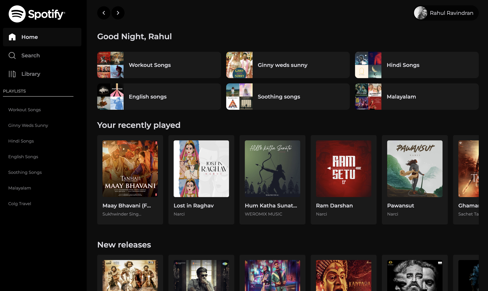

# Spotify clone

This project is a clone of the popular music streaming service, Spotify. It is built using ReactJS and uses the [spotify-web-api-js](https://www.npmjs.com/package/spotify-web-api-js) to pull dynamic user data.

## Features

1. User authentication using Spotify's Token system
1. Search for music tracks, albums, and artists
1. Play music tracks (preview)
1. View artist and album information

## Built With

1. [React JS](https://reactjs.org) - Context API fpr local state management
2. [spotify-web-api-js](https://www.npmjs.com/package/spotify-web-api-js)
3. [Styled-components](https://styled-components.com) for styling

## Reference Links

1. spotify-web-api-js [documentation](https://www.npmjs.com/package/spotify-web-api-js)

Learn more about the contribution guidelines [here](./.github/CONTRIBUTING.md)
